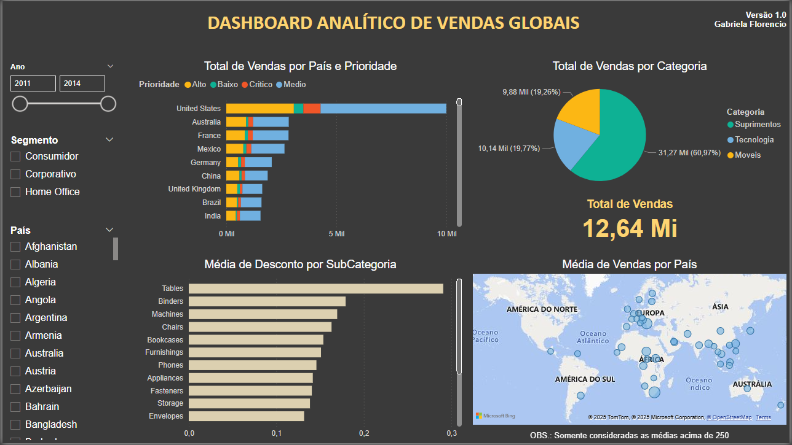

# 📊 DASHBOARD ANALÍTICO DE VENDAS GLOBAIS
## 📝 Descrição
Este projeto foi desenvolvido como parte de um estudo prático de Power BI, com o objetivo de analisar e visualizar dados de vendas. 

## 🛠️ Tecnologias e Ferramentas Utilizadas
* Power BI Desktop
* CSV/XLSX

## 📈 Funcionalidades e Gráficos Utilizados
* Filtros dinâmicos por ano, segmento e país
* Gráfico de barras empilhadas, de modo a apresentar 3 informações distintas (país, total de vendas e prioridade)
* Gráfico de pizza
* Mapa com Média de Vendas por localidade
* Gráfico de barras clusterizado

## 📚 Base de Dados
Dados provenientes do curso "Microsoft Power BI para Business Intelligence e Data Science" - Capítulo 2.

**Colunas**
* ID_Pedido
* Data_Pedido
* ID_Cliente
* Segmento
* Regiao
* Pais
* Product ID
* Categoria
* SubCategoria
* Total_Vendas
* Quantidade
* Desconto
* Lucro
* Prioridade

A Base de Dados é composta por 51.290 observações (linhas).
Dados disponíveis para baixar no formato CSV ou XLSX.

## 🖼️ Visualização do Dashboard
Você pode baixar o arquivo .pbix ou visualizar uma prévia abaixo:

## 📊 Principais KPIs Monitorados
* Vendas Totais
* Vendas realizadas por categoria de produto
* Quantidade de vendas por país, considerando a prioridade de entrega
* Média de desconto nas vendas por subcategoria de produto
* Países com maior média de valor de venda
